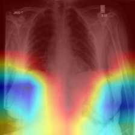
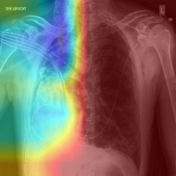
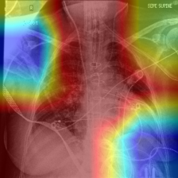
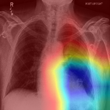
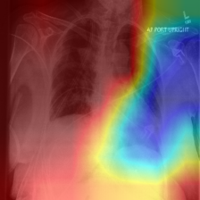

# 数据路径
CheXpert-v1.0-small \
├── CheXpert-v1.0-small \
│   ├── train/ \
│   ├── valid/ \
│   ├── train.csv \
│   └── valid.csv \
├── train.csv \
└── valid.csv \
数据下载链接：https://www.kaggle.com/datasets/willarevalo/chexpert-v10-small
存放于FUCA文件夹下
首先运行训练脚本，训练一个DenseNet121

```python
python
```

# 可信性与偏差分析报告（DenseNet121）

## 交付物 1：分层公平性分析详细报告

```bash
python Task_1_Fairness_Analysis.py
```

### 项目信息
- 项目阶段：Step 3 可信性与偏差分析
- 分析模型：DenseNet121
- 分析目的：评估模型在不同人口学子群体（性别、年龄）中的性能一致性，识别潜在的算法歧视与偏差
- 评估指标：AUC（衡量分类能力）、F1-Score（衡量精确率与召回率的平衡）、差异度量

### 1. 详细病症分析

#### 1.1 Cardiomegaly
- 总体表现：AUC 0.7660 | F1 0.5890
- 性别公平性：
  - 表现：女性群体 (AUC 0.7785) 略优于男性 (AUC 0.7547)
  - 差异：AUC = 0.0238，差异较小，模型对性别相对公平
- 年龄公平性：
  - 表现：模型在中年组 (41-65岁) 表现最佳 (AUC 0.8753)
  - 风险点：在老年组 (>65岁) 性能显著下滑 (AUC 0.6609)，F1 分数也较低
  - 差异：年轻组与老年组的差异明显 (AUC = 0.0891)。这提示模型难以应对老年人可能伴随的复杂胸部特征

#### 1.2 Edema
- 总体表现：AUC 0.8342 | F1 0.5410
- 性别公平性：
  - 表现：男性 (AUC 0.8313) 与女性 (AUC 0.8431) 表现几乎持平
  - 差异：AUC = 0.0118，这是性别公平性最好的病症之一
- 年龄公平性：
  - 表现：模型对年轻组 (<=40岁) 的识别极其精准 (AUC 0.9286)，可能是因为年轻人的肺部背景更清晰
  - 差异：年轻组与老年组 (>65岁, AUC 0.8305) 存在一定差距 (AUC = 0.0980)

#### 1.3 Consolidation
- 总体表现：AUC 0.6897 | F1 0.1026
- 关键问题：所有分组的 F1 分数都极低 (0.00 - 0.18)。表明模型虽然有一定的排序能力，但在确定阈值进行二分类时非常失败，存在高漏检率
- 公平性：性别差异 (AUC = 0.0318) 和年龄差异 (AUC = 0.0158) 均不大，说明模型是对所有群体普遍表现不佳

#### 1.4 Atelectasis —— [严重异常]
- 总体表现：AUC 0.4346（低于随机猜测的 0.5）
- 异常警报：整体 AUC 低于 0.5，说明模型学到了错误的特征（反向预测）
- 年龄公平性 (极度偏差)：
  - 年轻组 (<=40岁)：AUC 惊人地低至 0.0333，F1 为 0.00。这意味着对于年轻人，模型几乎把所有“有病”的都预测成“没病”，或者完全反向预测
  - 差异：年龄组间的 AUC 高达 0.4486
- 性别公平性：男性 (0.5122) 接近随机，女性 (0.3533) 表现极差，差异显著 (AUC = 0.1589)
- 结论：该模型在 Atelectasis 任务上是失败的，且对年轻女性具有极强的误导性

#### 1.5 Pleural Effusion
- 总体表现：AUC 0.8294 | F1 0.6174
- 性别公平性 (显著偏差)：
  - 表现：女性群体 (AUC 0.9028, F1 0.7727) 远好于男性 (AUC 0.7379, F1 0.3934)
  - 差异：AUC 达到 0.1649，F1 达到 0.3793。这是一个巨大的公平性缺口，模型显然更容易捕捉女性胸腔积液的特征
- 年龄公平性：
  - 表现：各年龄段表现非常稳定，AUC 均在 0.81-0.83 之间
  - 差异：AUC = 0.0022，这是模型在年龄维度上最鲁棒的病症

| 病症 | 最佳群体 | 最差群体 | 最大偏差来源 | 结论 |
|------|----------|----------|--------------|------|
| Cardiomegaly | 中年人 (0.87) | 老年人 (0.66) | 年龄 (=0.09) | 老年人误诊风险高，需人工复核。 |
| Edema | 年轻人 (0.93) | 中年人 (0.79) | 年龄 (=0.10) | 整体较好，年轻人诊断极准。 |
| Consolidation | 中年人 (0.71) | 年轻人 (0.67) | - | 模型整体性能不足 (F1极低)。 |
| Atelectasis | 男性 (0.51) | 年轻组 (0.03) | 年龄 (=0.45) | 模型不可用。对年轻人存在反向预测。 |
| Pleural Effusion | 女性 (0.90) | 男性 (0.74) | 性别 (=0.16) | 严重性别偏见。对男性诊断能力显著弱于女性。 |

### 结论
1. Atelectasis (肺不张)：模型在该病症上完全失败，且对年轻人有严重误导。建议停止使用该模型进行肺不张筛查，并重新检查训练数据标签或处理类别不平衡。
2. Pleural Effusion (胸腔积液)：模型存在严重的性别偏见，对男性患者的漏诊风险较高。在临床部署时，建议对男性患者的阴性结果进行重点复核。
3. Cardiomegaly (心脏扩大)：模型对老年人 (>65岁) 的预测能力显著下降。鉴于这是心脏扩大病症的高发群体，建议针对老年群体进行数据增强或模型微调，以提高其在目标人群中的可信度。

---

## 交付物 2：不确定性与解释分散性分析报告

```bash
python Task_2_Uncertainty_Analysis.py
```

### 项目信息
- 项目阶段：Step 3 可信性与偏差分析
- 分析对象：Cardiomegaly (心脏扩大)
- 分析目的：验证“模型越不确定（熵越高），其解释（热力图）越发散/混乱”的假设

### 2.1 定量相关性统计
我们计算了 234 个测试样本的模型预测熵 (Entropy) 与其 Grad-CAM 热力图方差 (Variance) 之间的相关性。
- 皮尔逊相关系数 (Pearson Correlation)：0.1478 ($p=0.0237$)
  - 解读：存在弱正相关，且具有统计学意义 ($p < 0.05$)。这表明当模型对预测感到不确定时，其关注的区域确实倾向于更加分散，但这种线性关系并不强。
- 斯皮尔曼相关系数 (Spearman Correlation)：0.0596 ($p=0.3643$)
  - 解读：未检测到显著的单调关系。说明两者之间的关系较为复杂，并非简单的“不确定性增加导致分散性增加”。

### 2.2 高不确定性样本定性分析 
我们提取了预测熵值最高的 5 个样本，通过 Grad-CAM 可视化分析其不确定性的来源。分析发现高不确定性主要由以下三种模式导致：

#### 模式一：弥散性关注 

<figure align="center">
  
  <figcaption>task2_uncertain_sample_3</figcaption>
</figure>


- 对应样本：task2_uncertain_sample_3
- 视觉特征：热力图呈“U”形分布，主要集中在两侧肺底和膈肌区域，完全避开了中心的心脏区域。
- 不确定性成因：特征缺失。模型无法在图像中找到典型的心脏边界特征，因此被迫在图像边缘（肺部下缘）寻找线索。这种“找不到目标”的状态直接导致了极高的预测熵值。

#### 模式二：医疗设备干扰

<table align="center" border="0">
  <tr>
    <!-- 第一张图 -->
    <td align="center" style="padding: 0 10px;">
      
      <p style="margin-top: 8px; font-size: 14px; color: #666;">task2_uncertain_sample_5</p>
    </td>
    <!-- 第二张图 -->
    <td align="center" style="padding: 0 10px;">
      
      <p style="margin-top: 8px; font-size: 14px; color: #666;">task2_uncertain_sample_1</p>
    </td>
  </tr>
</table>

- 对应样本：task2_uncertain_sample_5, task2_uncertain_sample_1
- 视觉特征：
  - 在 task2_uncertain_sample_5 中，有一条非常强烈的垂直红色热力带，直接沿着脊柱或中心静脉导管（Central Line）分布。
  - 在 task2_uncertain_sample_1 中，关注点杂乱地分散在颈部导管和左肩区域。
- 不确定性成因：抗干扰能力不足。DenseNet 模型被影像中高对比度的医疗管线（非生物特征）“带跑偏”。当模型基于管子而非心脏解剖结构做判断时，其决策置信度大幅下降。

#### 模式三：边界模糊与病理重叠
<table align="center" border="0">
  <tr>
    <!-- 第一张图 -->
    <td align="center" style="padding: 0 10px;">
      
      <p style="margin-top: 8px; font-size: 14px; color: #666;">task2_uncertain_sample_2</p>
    </td>
    <!-- 第二张图 -->
    <td align="center" style="padding: 0 10px;">
      
      <p style="margin-top: 8px; font-size: 14px; color: #666;">task2_uncertain_sample_4</p>
    </td>
  </tr>
</table>
- 对应样本：task2_uncertain_sample_2, task2_uncertain_sample_4
- 视觉特征：
  - task2_uncertain_sample_2 的热力图分裂成两块，一块在心脏边缘，另一块异常地出现在右上肺。
  - task2_uncertain_sample_4 的热力图虽然覆盖了心脏，但范围过大且模糊，向肺野延伸。
- 不确定性成因：病理混淆 (Silhouette Sign)。这些患者伴有其他肺部病变（如实变或积液），导致心脏边缘模糊不清。模型难以界定“哪里是心脏的结束，哪里是肺的开始”，从而在决策边界上犹豫不决。


---

## 交付物 3：与不确定性结合的偏差分析报告

```bash
python Task_3_Bias_Uncertainty_Analysis.py
```

### 分析目的
结合不确定性指标，进一步探究模型在不同人口学群体中的系统性偏差。

### 3.1 群体不确定性分布 
我们计算了不同群体的平均不确定性分数。分数越高，表示模型对该群体的判断越“犹豫/缺乏信心”。

| 群体维度 | 子群体 | 平均不确定性  | 样本量 |
|----------|--------|------------------------------|--------|
| 整体 | All | 0.3150 | 234 |
| 性别 | 女性 | 0.3233 | 106 |
| 性别 | 男性 | 0.3081 | 128 |
| 年龄 | 年轻组 (<=40岁) | 0.2881 | 34 |
| 年龄 | 中年组 (41-65岁) | 0.3042 | 99 |
| 年龄 | 老年组 (>65岁) | 0.3346 (最高) | 101 |

#### 分析结论
1. 年龄偏差显著：不确定性随年龄增长而增加。模型对老年患者 (>65岁) 最缺乏信心。这与交付物 1 中老年组 AUC 最低 (0.66) 的结果相互印证：模型不仅预测得不准，而且它自己也“知道”这一点。
2. 性别的“高能低信”悖论：尽管交付物 1 显示女性组的 AUC (0.78) 高于男性，但模型对女性样本的不确定性反而略高。这表明模型在处理女性样本时虽然准确率高，但决策过程更为“谨慎”。

### 3.2 不确定性与解释一致性 
通过 MC Dropout (10次循环) 计算模型在不同状态下解释热力图的一致性。
- 皮尔逊相关系数：-0.0305 ($p=0.6425$)
- 斯皮尔曼相关系数：-0.0043 ($p=0.9473$)

#### 结论
不确定性与解释一致性之间不存在显著相关性。即便在模型高度不确定的情况下，其多次推理产生的热力图区域也是相对稳定的。这说明模型的不确定性主要源于“特征本身的模糊”，而不是模型参数的剧烈波动。

