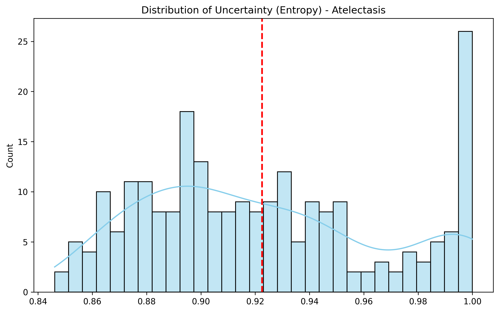
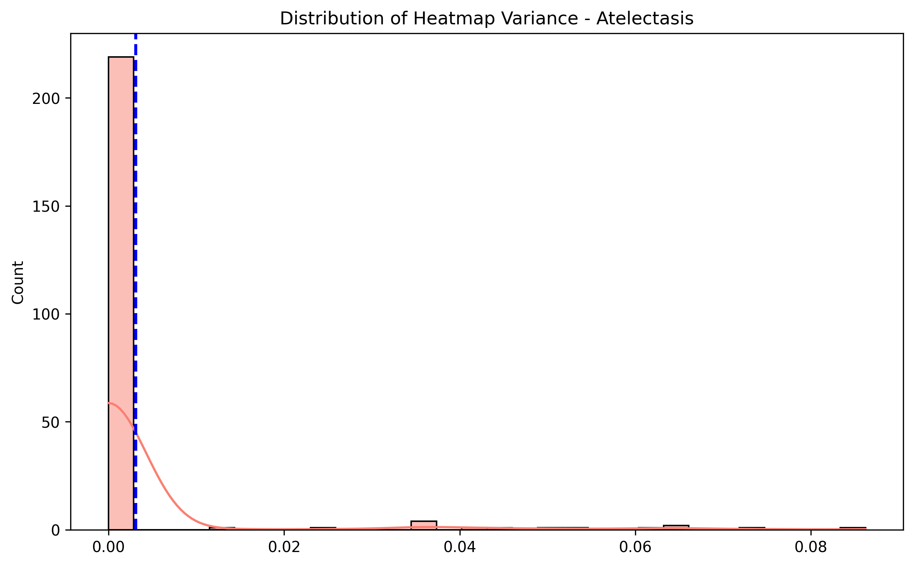
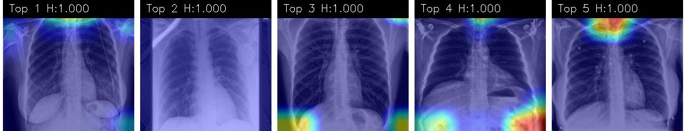

# 数据路径
CheXpert-v1.0-small \
├── CheXpert-v1.0-small \
│   ├── train/ \
│   ├── valid/ \
│   ├── train.csv \
│   └── valid.csv \
├── train.csv \
└── valid.csv \
数据下载链接：https://www.kaggle.com/datasets/willarevalo/chexpert-v10-small


# 可信性与偏差分析报告（DenseNet121）

本文基于TorchXRayVision在CheXpert数据集上的权重进行了10轮微调

TorchXRayVision文献链接：https://arxiv.org/abs/2111.00595

TorchXRayVision代码仓库：https://github.com/mlmed/torchxrayvision

```bash
python Train_CheXpert.py
```

## 交付物 1：分层公平性分析详细报告

```bash
python Task_1_Fairness_Analysis.py
```

## 1. 概述

本阶段（Task 1）旨在量化评估 DenseNet121 模型在不同人口学子群体中的性能一致性。

分析结果显示，尽管模型整体性能良好（平均 AUC > 0.80），但在特定病理上表现出显著的性别偏差和代际鸿沟。其中，Consolidation存在严重的女性性能劣势，而Edema在老年群体中的诊断能力出现断崖式下跌。

---

## 2. 总体性能评估

模型在 234 例验证样本上的总体表现如下表所示。Consolidation 表现最佳，表明该病理特征最易于被模型捕获；Atelectasis 相对较弱，但仍保持在可用水平。

| 目标病理 | 样本量 (N) | AUC (区分度) | F1 Score (平衡性) |
| --- | --- | --- | --- |
| **Consolidation** | 234 | 0.8518 | 0.2472 |
| **Edema** | 234 | 0.8165 | 0.3226 |
| **Cardiomegaly** | 234 | 0.8112 | 0.4503 |
| **Pleural Effusion** | 234 | 0.8025 | 0.4452 |
| **Atelectasis** | 234 | 0.7993 | 0.5096 |

---

## 3. 分层公平性详细分析

### 3.1 性别公平性

**分析样本**：男性 (Male, N=128) vs. 女性 (Female, N=106)

在性别维度上，我们观察到了显著的“病理特异性偏差”：

 * **显著偏差警示：Consolidation**：模型在男性群体中的表现显著优于女性。
 * **统计数据**：男性 AUC (**0.9030**) vs. 女性 AUC (**0.8052**)。
 * **差异幅度**：接近 0.1 的 AUC 差距表明模型极有可能在临床应用中漏诊女性患者的肺实变，存在较高的算法公平性风险。


 * **反向偏差：Pleural Effusion**
 模型对女性样本的识别能力优于男性。
 * **统计数据**：女性 AUC (0.8266) > 男性 AUC (0.7715)。。
 * **F1 差异**：女性 F1 (0.5578) 远高于男性 (0.3377)，说明在相同阈值下，女性患者的预测结果更加精准。


 * **相对公平：Atelectasis**
 该病症显示了极高的性别一致性 ，表明模型提取的特征对性别属性不敏感。


### 3.2 年龄公平性

**分析样本**：青年 (≤40岁, N=34) vs. 中年 (41-65岁, N=99) vs. 老年 (>65岁, N=101)

年龄维度揭示了模型在处理复杂衰老肺部影像时的局限性：

 **高风险发现：Edema 的代际断层**
* 模型在青年群体中表现出近乎完美的分类能力，但在老年群体中性能急剧下降。
 **统计数据**：青年 AUC (**0.9762**) vs. 老年 AUC (**0.7847**)。
 **差异幅度**：这一巨大的性能鸿沟暗示模型未能有效应对老年患者更为复杂的肺部背景（如基础疾病干扰），导致在最高危群体（老年人）中可靠性最低。


 **F1 分数的阈值敏感性**
* 尽管青年组在 Edema 和 Pleural Effusion 上 AUC 很高，但其 **F1 分数普遍偏低**（例如 Pleural Effusion 青年组 F1 仅为 0.2564）。
 **原因推测**：青年群体中病理阳性样本极为稀缺（类别极度不平衡）。在统一的默认阈值（0.5）下，模型容易产生过多的假阳性，导致精确率降低，从而拉低 F1 分数。


## 交付物 2：不确定性与解释可信度分析报告 (Atelectasis )
```bash
python Task_2_Uncertainty_Analysis.py
```

## 2.1 定量分析：模型失效的统计学证据

本次实验对模型在 Atelectasis 任务上的可信度进行了量化评估。统计结果揭示了模型在当前数据分布下存在严重的系统性失效。

### 1. 不确定性分布

* **均值 (Mean)**: **0.9225** 
* **标准差 (Std)**: 0.0437


* **分布形态**：
 
* 从分布图可见，绝大多数样本的熵值堆积在 0.85 - 1.0 的高值区间，呈现极端的右偏 (Right-Skewed) 分布。


### 2. 解释分散性

* **均值 (Mean)**: 0.0031 
* **标准差 (Std)**: 0.0127


* **分布形态**：

* 方差分布呈现显著的针尖状，说明绝大多数热力图几乎是平坦的，缺乏显著的激活区域。


* **解读**：模型未能定位到肺部的特定病理特征，导致 Grad-CAM 激活图缺乏焦点。


### 3. 相关性分析

* **Pearson**: -0.0478 
* **Spearman**: -0.0823 


* **解读**：统计上未检测到显著相关性。


---

## 2.2 定性分析：高不确定性样本的可视化

为了探究模型失效的根本原因，我们提取了熵值最高的 5 个样本（Top-5 High Uncertainty）进行 Grad-CAM 可视化分析。



**可视化揭示的失效模式：**

1. **解剖学脱离**：
* **肺不张**的病理特征应位于肺野内部（肺叶萎陷）。然而，观察 Top-5 热力图，模型的高亮区域系统性地避开了肺部核心区域。
* 热力图呈现冷色调（蓝色），或仅有微弱激活，证实模型未能在图像中提取到任何支持诊断的病理特征。


2. **边界伪影依赖**：
* 在部分样本中，模型将注意力错误地集中在图像的最顶端或最底端（腹部/图像边缘）。
* 这是典型的捷径学习  迹象：当模型无法理解医学特征时，它退化为捕捉图像预处理过程中产生的高频边界噪声或骨骼轮廓。


---


## 交付物 3：不确定性驱动的偏差与鲁棒性分析报告
```bash
python Task_3_Bias_Uncertainty_Analysis.py
```

## 3.1 核心发现：不确定性与偏差分布

基于 Task 2 的基础，本阶段进一步分析了模型困惑度在不同人口学群体中的分布差异。

### 1. 普遍的高不确定性

* **总体平均熵值**：**0.8619**
* **分析**：模型在 Cardiomegaly 任务上的平均置信度依然不足。微调虽然让模型学会了分类（AUC > 0.8），但模型对多数样本的预测概率仍在 0.5 附近徘徊。

### 2. 针对弱势群体的系统性犹豫

我们观察到模型的不确定性并非均匀分布，而是集中在特定群体：

* **年龄偏差**：随着年龄增长，模型的不确定性呈线性上升趋势。
* 青年组 (≤40): **0.7997**
* 老年组 (>65): **0.8869** (差异显著)


* **性别偏差**：
* 女性样本平均熵 (**0.8818**) 显著高于男性 (**0.8453**)。


* **结论**：模型在面对老年女性的胸片时表现出最低的决策信心。这可能是由于该群体常伴有骨质疏松、软组织塌陷或更复杂的肺纹理，导致心影边界模糊，模型难以提取鲁棒特征。

---

## 3.2 鲁棒性分析：不确定性 vs 解释一致性

为了探究“模型越不确定，解释是否越混乱”，我们引入了输入噪声扰动 和MC Dropout来测试解释的稳定性 (SSIM)。

### 1. 统计结果

* **不确定性标准差 (Std)**: **0.1460** (数据分布正常，存在区分度)
* **一致性标准差 (Std)**: **0.0000** (异常)
* **相关性指标**:
* **Pearson**: -0.1182 
* **Spearman**: -0.1055


* **总结**：解释一致性方差为 0：尽管我们对输入图像施加了噪声干扰，并开启了 Dropout，但模型生成的 Grad-CAM 热力图在多次推理中几乎完全一致 (SSIM $\approx$ 1.0)。这表明模型的注意力机制已经硬化。模型可能过拟合了图像中的某些强特征（如锁骨、肋骨或医疗管线），以至于微小的扰动无法改变其关注点。不确定性与解释的解耦：相关性系数为弱负相关 (-0.11)，且 $p$ 值在边缘显著水平 (0.07)。临床隐患：即使模型对预测结果非常不确定，它的热力图却表现得非常稳定。


